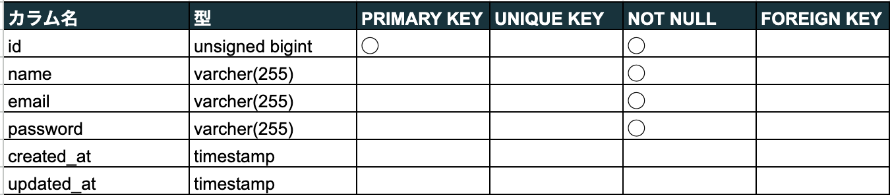
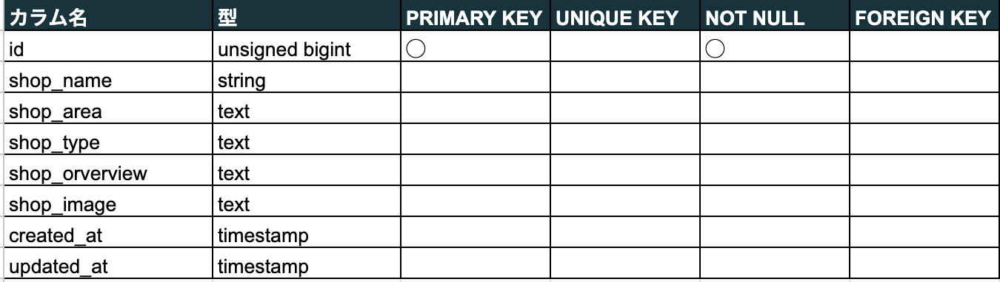
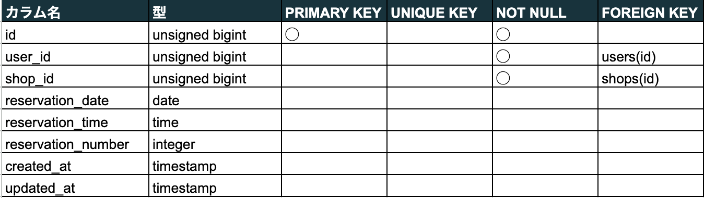
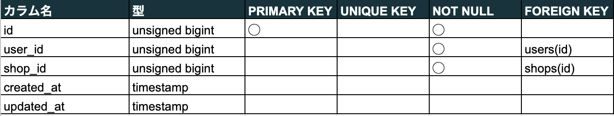
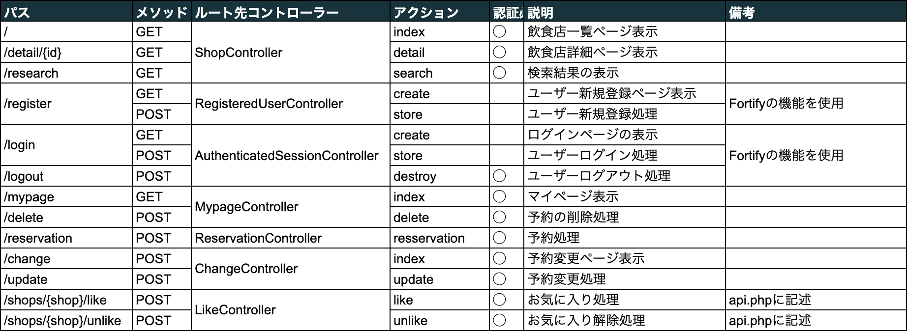
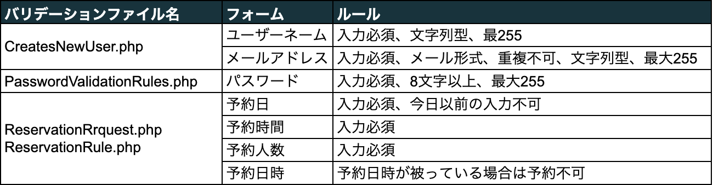

# Rese（リース）
Reseはある企業のグループ会社の飲食店予約サービスです。


## 作成した目的
外部の飲食店予約サービスは手数料を取られるため、自社で予約サービスを持つことで当該問題を解決できると考え、作成しました。

## アプリケーションURL
- 開発用環境<http://localhost/>
- 本番環境<http://52.55.221.74/>

開発用環境におけるサーバーにSSH接続する公開鍵のファイルは以下になります。
- mockcase2key.pub
  
また、使用する店舗のデータはDBにあるため、始めにシーディングしてください。(本番環境は既にしてあります。)

## 機能一覧
- 会員登録機能
- ログイン機能
- ログアウト機能
- ユーザー情報取得
- ユーザー飲食店お気に入り一覧取得
- ユーザー飲食店予約情報取得
- 飲食店一覧取得
- 飲食店詳細取得
- 飲食店お気に入り追加
- 飲食店お気に入り削除
- 飲食店予約情報追加
- 飲食店予約情報削除
- エリアで検索する
- ジャンルで検索する
- 店名で検索する
- 予約変更機能
- 認証と予約時のパリデーション
- メール認証機能
- メール送信機能 (開発用メールサーバー)
- AWS
- 環境の切り分け

## 使用技術（実行環境）
- フレームワーク
  - Laravel 8.83.8
  - Vue.js 2.7.16
- 言語
  - php
  - html
  - css
  - javascript

## テーブル設計
Usersテーブル


Shopsテーブル


Reservationsテーブル


likesテーブル


## ER図


## 環境構築
#### プロジェクトのセットアップ手順
##### ディレクトリの作成
アプリケーションを作成するために、開発環境を GitHub からクローンします。
`laravel-docker-template.git`をクローンしてください。
```bash
$ git clone git@github.com:coachtech-material/laravel-docker-template.git
```
##### Docker の設定
次に、Docker の設定を行なっていきます。
複数のコンテナを扱うのでdocker-composeを使います。
```bash
$ docker-compose up -d --build
$ code .
```
##### Laravel のパッケージのインストール
docker-composeコマンドで PHPコンテナ内にログインし、composerコマンドを使って必要なパッケージをインストールします。
```bash
$ docker-compose exec php bash
$ composer install
```
##### .envファイルの作成
.envファイルは、.env.exampleファイルをコピーして作成しましょう。
```bash
$ cp .env.example .env
$ exit
```
.envファイルは以下のように修正します。
```
// 前略
DB_CONNECTION=mysql
DB_HOST=mysql
DB_PORT=3306
DB_DATABASE=laravel_db
DB_USERNAME=laravel_user
DB_PASSWORD=laravel_pass
// 後略
```
##### viewファイルの作成
各ページのviewファイルを作成します。
resources/viewsに、以下のBladeファイルを作成します。
- change.blade.php　&emsp;...予約変更ページ
- detail.blade.php  &emsp;...店舗詳細ページ
- done.blade.php  &emsp;...予約完了ページ
- mypage.blade.php  &emsp;...マイページ
- shop.blade.php  &emsp;...店舗一覧ページ

resources/views/authには以下のBladeファイルを作成します。
- login.blade.php  &emsp;...ログインページ
- mypage.blade.php  &emsp;...会員登録ページ
- verify-email.blade.php  &emsp;...会員登録完了&メール認証ページ

resources/views/layoutsには以下のBladeファイルを作成します。
- app.blade.php  &emsp;...ヘッダー

また、お気に入り機能、予約機能及びメニュー表示を非同期で実装するため、以下のjsファイルとComponentを作成します。
- like.js
- menu.js
- confirm.js
- LikeComponent.vue
- MenuComponent.Vue
- Menu2Component.Vue
- Confirm.Vue

##### cssファイルの作成
public/cssに以下のcssファイルを配置します。
- change.css
- confirm.css
- detail.css
- done.css
- layout.css
- like.css
- login.css
- menu.css
- mypage.css
- register.css
- verify-email.css
- shop.css
- sanitize.css

##### RouteとControllerの作成
Controllerファイルを作成し、以下のルート及びアクションを紐付けします。


##### Modelの作成
各モデルを作成します。
- User.php
- Shop.php
- Reservation.php
- Likes.php

##### バリデーションの作成
各ファイルを作成します。なお、ログインや登録の際のバリデーションはFortifyに備わっている機能を使用します。


#####　バリデーションの日本語化
バリデーションを日本語表示にするため、以下のコマンドにより、/resources/lag/ja/validation.phpを作成します。
```bash
$ php -r "copy('<https://readouble.com/laravel/8.x/ja/install-ja-lang-files.php>', 'install-ja-lang.php');"
$ php -f install-ja-lang.php
$ php -r "unlink('install-ja-lang.php');"
```
また、承認メールは以下のコマンドにより/resources/lag/ja.jsonを作成します。
```bash
php artisan vendor:publish --tag=laravel-notifications
```

####　ツールの導入
##### Vue.jsの導入
下記コマンドでpackage.jsonに記述されているパッケージをインストールします。
```bash
$ npm install
```
プロジェクトをビルドします。
```bash
$ npm run watch
```

##### Fortifyの導入
Laravelをインストールしたプロジェクト内でfortifyをインストールし、関連ファイルを作成します。
その後、マイグレートを実行します。
```bash
$ composer require laravel/fortify
$ php artisan migrate
$ php artisan vendor:publish --provider="Laravel\Fortify\FortifyServiceProvider"
```

##### Mailhogによるメール送信機能の確認
以下の記述を.envファイルに追加しイメージをビルドして使用します。なお、メールサーバーは有料であったため今回は使用していません。
```
MAIL_MAILER=smtp
MAIL_HOST=mailhog
MAIL_PORT=1025
MAIL_USERNAME=maccha
MAIL_PASSWORD=abcdsfgn
MAIL_ENCRYPTION=null
MAIL_FROM_ADDRESS=<example@gmail.com>
MAIL_FROM_NAME="${APP_NAME}"
```

##### EC2の環境構築
AWSにログイン後、EC2インスタンスを作成します。
Amazon Linux 2にログイン後、nginx、php、composerをイ
ンストールします。
pHp-fp、nginxの設定を行います。
上記で作成したLaravelプロジェクトをGitHubからクローンします。
sockの設定、app/storageの権限の変更、phpライブラリのインストール、.envファイルの設定を行います。
以下のURLから閲覧できます。
<http://13.231.44.24/>
また、Dockerをインストールしmailhogによるメール送信ができるようにします。

##### RDSの環境構築
AWSにログイン後、RDSでデータベースを作成します。
Amazon Linux 2にログイン後、MySQLをインストールします。
E上記で使用したC2インスタンスのセキュリティグループを設定します。
.envを変更します。
マイグレーションを実行します。

##### S3の環境構築
